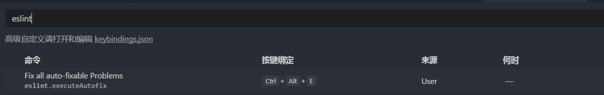
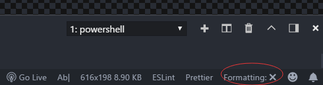

# ape-plan

> 很棒棒少年团前端项目

## Build Setup

``` bash
# 安装开发依赖
npm install #or yarn install

# 本地开发预览 localhost:8080
npm run dev #or yarn run dev

# 压缩打包
npm run build #or yarn run build

# 项目打包文件分析 analyze
npm run analyze #or yarn run analyze

# eslint 代码检查
npm run lint #or yarn run lint

```

### Tips:
1. windows 提交时先执行 `git config --global core.autocrlf false` 关掉 git 的自动换行转换。
2. 如果 git 下载的体积比较大，请在后面加上 `--depth=1` 参数，例如：
`git clone https://github.com/Tex-wz/BBT.git --depth=1`

### vscode 开发配置

开发环境：win10 + vscode

1. vscode 搜索安装 eslint 插件
2. 在 vscode 设置里面加入以下配置:
```json
    "eslint.enable": true,
    "eslint.alwaysShowStatus": true,
    "eslint.nodePath": "C:\\APPS\\nodejs",
    "eslint.options": {
      "plugins": ["vue"]
    },
    "eslint.validate": [
        "javascript",
        "javascriptreact",
        {
            "language": "vue",
            "autoFix": true,
        },
        {
            "language": "html",
            "autoFix": true
        },

    ],
```
  * 其中的 `eslint.nodePath` 为 node 安装位置，根据电脑上的 node 安装位置配置;
  * 如果不知道 node 安装位置： cmd 命令行输入 `where node` 查看。

3. 设置>键盘快捷方式 搜索 eslint 设置一个自己喜欢的快捷修复整理按键;

4. 关掉 vscode 自身格式化代码的插件, 点击 Fromatting  状态变为 x;

